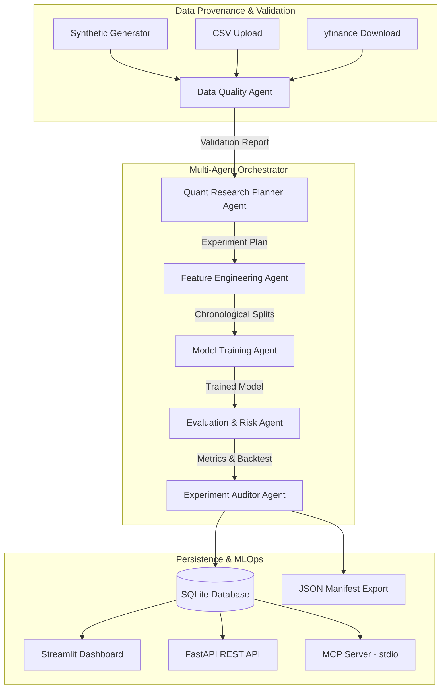

# ⚡ QuantLab Pro: Multi-Agent Quantitative ML Research Platform

[](https://github.com/Dhanya562004/quantlab-pro/actions)
[](https://www.python.org/)
[](https://streamlit.io/)
[](https://modelcontextprotocol.io/)
[](LICENSE)

**QuantLab Pro** is an integrated quantitative machine learning research platform designed around multi-agent orchestration, leakage-resistant feature engineering, reproducible experiment tracking, and Model Context Protocol (MCP) tool integration. 

Built to align with **Tower Research Capital's Intern - AI/ML** job competencies, QuantLab Pro provides a complete test-driven Python research framework for market time-series analysis, baseline & neural network model evaluation, backtest simulation, and MLOps inference.

---

## 🏛️ System Architecture

QuantLab Pro coordinates a deterministic multi-agent pipeline passing typed Pydantic state across 6 specialized research agents:



---

## 🔑 Primary Competencies Demonstrated

| Competency | Implementation in QuantLab Pro |
| :--- | :--- |
| **Multi-Agent Systems & MCP** | 6 specialized agents, typed Pydantic state passing, allowlisted tool registry, official Python MCP SDK server & client. |
| **Agentic Coding Workflows** | Complete developer guide (`AGENTIC_WORKFLOW_GUIDE.md`) for using Claude Code, Cursor, and Codex for refactoring and debugging. |
| **Statistical & ML Algorithms** | Majority Class baseline, Logistic Regression, PyTorch MLP classifier, classification metrics, and research backtest engine. |
| **MLOps & Reproducibility** | SHA-256 dataset fingerprinting, SQLite experiment store, JSON manifests, optional MLflow integration, and FastAPI REST endpoints. |
| **Quantitative Finance** | Leakage-resistant target shifting, lagged indicators, chronological train/val/test splits, transaction cost penalties (bps), Sharpe ratio, and max drawdown. |

---

## 🛠️ Data Provenance & Quantitative Validation

QuantLab Pro provides 3 explicit dataset modes with full provenance tracking:
1. **Synthetic Data**: Deterministic Geometric Brownian Motion generator with seed control (`quantlab/data/synthetic.py`).
2. **CSV Upload**: User CSV validation with column standardization (`quantlab/data/loader.py`).
3. **yfinance Download**: Optional live market data download with graceful error handling.

Every dataset receives a **SHA-256 fingerprint** of raw values. The **Data Quality Agent** executes comprehensive quantitative audits:
- Schema & column presence (`Date`, `Open`, `High`, `Low`, `Close`, `Volume`).
- Timestamp ordering & strict ascending monotonicity.
- Duplicate timestamp detection & missing value check.
- Non-positive price validity and price boundary integrity (`High >= max(Open, Close)` and `Low <= min(Open, Close)`).
- Return jump outlier detection.
- Minimum sample size adequacy check.

---

## 🛡️ Leakage-Resistant ML Experiments

To guarantee zero look-ahead bias:
- **Target Alignment**: Target $y_t = \text{sign}(\text{Close}_{t+h} - \text{Close}_t)$ is shifted by $-h$, ensuring feature row at $t$ strictly uses information available up to period $t$.
- **Chronological Splits**: Data is split sequentially (e.g., 60% Train, 20% Val, 20% Test) without random shuffling.
- **Preprocessing Scaler**: `StandardScaler` is fit **strictly** on the training split (`X_train`), then applied to `X_val` and `X_test`.

### Supported Model Architecture Comparison
- **Baseline Majority Class**: Always predicts most frequent training class.
- **Logistic Regression**: Scikit-learn L2-regularized linear baseline.
- **PyTorch MLP Classifier**: Multi-layer neural network with BatchNorm, ReLU, Dropout, and Adam optimizer (`quantlab/models/pytorch_mlp.py`).

---

## 🤖 6 Specialized Quantitative Research Agents

1. `DataQualityAgent`: Validates dataset schema, pricing integrity, date ordering, and sample adequacy.
2. `QuantResearchPlannerAgent`: Selects allowlisted model type, target horizon, and articulates research rationale.
3. `FeatureEngineeringAgent`: Constructs 14 technical features (lags, rolling vol, RSI, MACD) and chronological dataset splits.
4. `ModelTrainingAgent`: Trains selected model using fixed random seeds and records training duration.
5. `EvaluationRiskAgent`: Evaluates held-out test split, computes backtest returns curve (with transaction costs in bps), and checks for suspicious accuracy (>90%) or class imbalance.
6. `ExperimentAuditorAgent`: Compiles JSON reproducibility manifest and persists experiment run to SQLite database.

---

## 🛠️ Safe Tool-Calling & Official MCP Implementation

QuantLab Pro implements an allowlisted tool registry (`ToolRegistry`) with Pydantic argument schemas:
- `dataset_summary`: Returns shape, date range, and SHA-256 fingerprint.
- `validate_dataset`: Runs data quality audit.
- `run_experiment`: End-to-end training and backtesting pipeline.
- `get_experiment_metrics`: Fetches metrics from SQLite database.
- `get_experiment_manifest`: Retrieves JSON manifest from SQLite.

### Running the MCP Server & Integration Client
The official MCP Server (`mcp_server/server.py`) exposes these tools over stdio transport:
```bash
# Run MCP Local Client Integration Verification
python -m mcp_server.client

# Launch MCP Server
python -m mcp_server.server
```

---

## 🚀 Quick Start & Local Services

### 1. Installation
```bash
git clone https://github.com/Dhanya562004/quantlab-pro.git
cd quantlab-pro
pip install -r requirements.txt
```

### 2. Launch Streamlit Dashboard
```bash
streamlit run app.py
```

### 3. Run PyTest Test Suite & Ruff Linter
```bash
pytest -v
ruff check .
```

### 4. Run Local FastAPI REST Service
```bash
uvicorn api.main:app --reload --port 8000
```
- API Health Endpoint: `GET http://localhost:8000/health`
- Prediction Endpoint: `POST http://localhost:8000/predict`
- Monitoring Endpoint: `GET http://localhost:8000/monitoring/distribution`

---

## ☁️ Streamlit Community Cloud Deployment

To deploy this application to Streamlit Community Cloud:
1. Push this repository to GitHub: `https://github.com/Dhanya562004/quantlab-pro.git`
2. Log into [Streamlit Community Cloud](https://streamlit.io/cloud).
3. Select **New App** -> choose `Dhanya562004/quantlab-pro` repository and `main` branch.
4. Set Main File Path to `app.py`.
5. Click **Deploy!**

*Note: The Streamlit Community Cloud deployment runs the standalone dashboard. The local MCP server and FastAPI service run independently for local CLI or sub-process integration.*

---

## 🔒 Educational Research Disclaimer

**QuantLab Pro is designed exclusively for educational research, academic exploration, and technical demonstration.** 
It does NOT provide investment advice, financial recommendations, or automated live trading capability. Historical simulated backtests do not guarantee future live trading results.
