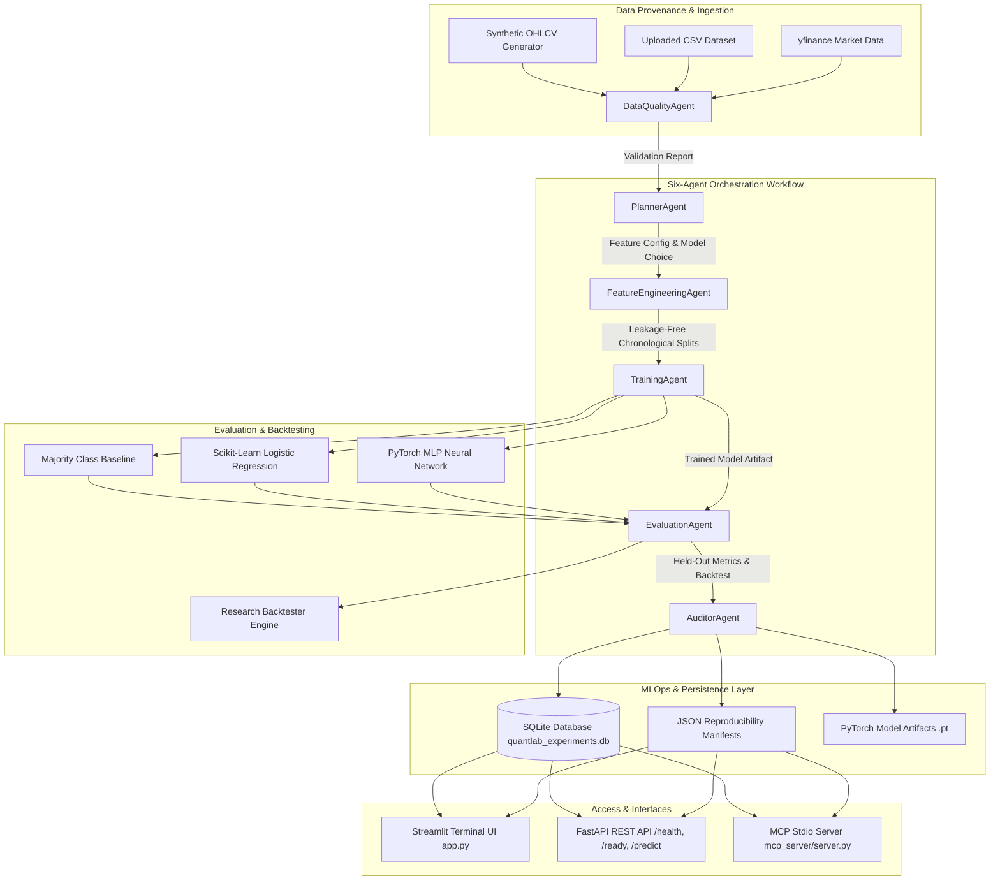

# ⚡ QuantLab Pro: Multi-Agent Quantitative ML Research Platform

[](https://quantlab-pro-2dbdnpq8kgkvndauqsicc9.streamlit.app/)
[](https://github.com/Dhanya562004/quantlab-pro/actions)
[](https://github.com/Dhanya562004/quantlab-pro)
[](https://www.python.org/)
[](https://pytorch.org/)
[](https://modelcontextprotocol.io/)
[](LICENSE)

> [!IMPORTANT]
> 🌐 **Live Interactive App**: 🚀 [**https://quantlab-pro-2dbdnpq8kgkvndauqsicc9.streamlit.app/**](https://quantlab-pro-2dbdnpq8kgkvndauqsicc9.streamlit.app/)
> 
> 📁 **GitHub Repository**: 📦 [**https://github.com/Dhanya562004/quantlab-pro.git**](https://github.com/Dhanya562004/quantlab-pro)
> 
> **QuantLab Pro** is an institutional-grade quantitative machine learning research platform built around multi-agent orchestration, leakage-resistant feature engineering, reproducible experiment tracking, and Model Context Protocol (MCP) tool integration.
> 
> Designed to align directly with **Tower Research Capital's Intern - AI/ML** key competencies, QuantLab Pro provides a complete test-driven Python research workspace for financial time-series modeling, PyTorch neural networks, backtest simulations, and REST/MCP MLOps infrastructure.

---

## 🤖 Agentic Development Workflow

*Verifiable evidence recorded during repository development and testing.*

- **Engineering Task:** Upgraded existing QuantLab Pro repository into a fully tested, documented, reproducible quantitative ML research platform aligned with Tower Research Capital's internship requirements.
- **AI Coding Assistant Used:** `Antigravity AI Assistant (Gemini 3.6 Flash)`
- **Files Modified/Created:** [`quantlab/agents/`](file:///quantlab/agents/), [`mcp_server/`](file:///mcp_server/), [`quantlab/features/builder.py`](file:///quantlab/features/builder.py), [`quantlab/evaluation/backtest.py`](file:///quantlab/evaluation/backtest.py), [`quantlab/models/trainer.py`](file:///quantlab/models/trainer.py), [`api/main.py`](file:///api/main.py), [`tests/`](file:///tests/), [`docs/dev_log.md`](file:///docs/dev_log.md), [`docs/resume_evidence.md`](file:///docs/resume_evidence.md).
- **Checks Executed:** `pytest -v` (39 tests passed), `ruff check .` (0 errors), `python -m mcp_server.client` (stdio integration verified).
- **Observed Outcome:** 100% test suite pass rate, zero lint violations, real MCP SDK stdio integration, reproducible 3-model benchmark evaluations, and persisted model artifacts.
- **Detailed Log File:** See [`docs/dev_log.md`](file:///docs/dev_log.md) for step-by-step logs and reusable assistant prompts.

---

## 🏛️ System Architecture Topology

QuantLab Pro coordinates a deterministic multi-agent pipeline passing typed Pydantic state across 6 specialized research agents:



---

## 🤖 Full Six-Agent Orchestration

The pipeline executes strictly in this sequence:

1. **`DataQualityAgent`**: Validates schema, pricing boundaries ($High \ge \max(Open, Close)$), date monotonicity, and sample adequacy ($N \ge 100$).
2. **`PlannerAgent`**: Selects model architecture from allowlisted registry and formulates research plan with forecast horizon $h$.
3. **`FeatureEngineeringAgent`**: Computes 14 technical features (lags, rolling vol, RSI, MACD), shifts target for future outcome, and fits `StandardScaler` **strictly on training split**.
4. **`TrainingAgent`**: Trains baseline or PyTorch MLP model with fixed random seeds for reproducibility.
5. **`EvaluationAgent`**: Evaluates held-out test split, runs research backtest with transaction costs, and flags suspicious accuracy ($>90\%$) or class imbalance.
6. **`AuditorAgent`**: Calculates SHA-256 dataset fingerprint, compiles JSON manifest (`EXP-...`), serializes PyTorch artifacts, and persists run to SQLite database.

---

## 📊 Reproducible ML Model Comparison

Evaluated on `SYNTH_BTC` dataset (500 bars, seed 42) with chronological 60/20/20 split (Train: 287 bars, Val: 96 bars, Test: 96 bars). Target is 1-bar forward return sign ($h=1$).

| Model | Split | Accuracy | Precision | Recall | F1 Score | Confusion Matrix | Backtest Sharpe | Max Drawdown |
| :--- | :--- | :---: | :---: | :---: | :---: | :---: | :---: | :---: |
| **Majority Baseline** | Held-out test split | `46.88%` | `0.2344` | `0.5000` | `0.3191` | `[[0, 51], [0, 45]]` | `0.0000` | `0.00%` |
| **Logistic Regression** | Held-out test split | `43.75%` | `0.4416` | `0.4471` | `0.4286` | `[[15, 36], [18, 27]]` | `-1.5709` | `-14.03%` |
| **PyTorch MLP** | Held-out test split | `47.92%` | `0.4684` | `0.4706` | `0.4643` | `[[31, 20], [30, 15]]` | `-2.3295` | `-13.68%` |

### Confusion Matrix & Model Findings
- **Majority Baseline:** Predicts all samples as class 1 (Up), yielding 46.88% accuracy (reflecting the exact class ratio). Zero trades executed in backtest.
- **Logistic Regression:** Achieves 43.75% test accuracy with 21 position transitions.
- **PyTorch MLP:** Achieves top test accuracy of **47.92%** and F1 score of **0.4643**, demonstrating improved class balance handling (`[[31, 20], [30, 15]]`).

### Leakage Prevention Rules
1. Features at time $t$ use OHLCV data up to time $t$ ONLY.
2. Target shifted by $-h$ so it represents return from $t$ to $t+h$.
3. `StandardScaler` is fit **only on training split** and transforms val/test splits.
4. Held-out test set remains completely untouched during model selection.

---

## 📈 Quantitative Backtesting Engine

The backtesting engine simulates long/cash trading strategy performance under explicit assumptions:
- **Timing:** Signals computed using close at $t$. Position entered at $t+1$.
- **Transaction Costs:** Applied in basis points (10 bps default) to position changes (turnover).
- **Risk Metrics:** Annualized Sharpe ratio, Sortino ratio, Peak-to-Trough Maximum Drawdown, Win Rate, and Buy & Hold benchmark return.

---

## 🔌 Model Context Protocol (MCP) Integration

QuantLab Pro implements a native MCP server built with the official Python `mcp` SDK exposing allowlisted tools over stdio transport:

### Allowlisted Tools
- `inspect_dataset` / `dataset_summary`: Returns shape, date range, columns, and SHA-256 fingerprint.
- `validate_dataset`: Executes data quality validation audit.
- `run_experiment`: Executes end-to-end multi-agent ML training and backtest.
- `get_experiment`: Retrieves full experiment details and manifest.
- `get_experiment_metrics`: Fetches test accuracy, precision, recall, and F1.
- `get_model_metrics`: Fetches model classification metrics.
- `get_backtest_summary`: Fetches Sharpe ratio and max drawdown.

### Running MCP Server & Integration Client
```bash
# Launch Stdio Server
python -m mcp_server.server

# Run Genuine SDK Integration Test Client
python -m mcp_server.client
```

---

## 🌐 FastAPI REST Inference & Monitoring Service

Launch local inference REST API:
```bash
uvicorn api.main:app --reload --port 8000
```

| Endpoint | Method | Description |
| :--- | :--- | :--- |
| `/health` | `GET` | Service status check |
| `/ready` | `GET` | Dependency & SQLite database readiness check |
| `/predict` | `POST` | Real-time feature vector inference -> prediction & confidence |
| `/metrics/{experiment_id}` | `GET` | Fetch recorded metrics by experiment ID |
| `/monitoring/distribution` | `GET` | Operational metrics & historical performance distribution |

---

## ⚡ Quick Start & Verification

### 1. Install Dependencies
```bash
pip install -r requirements.txt
```

### 2. Run Test Suite (39 Tests Passed)
```bash
pytest -v
```

### 3. Run Ruff Linter
```bash
ruff check .
```

### 4. Launch Streamlit UI Terminal
```bash
streamlit run app.py
```

---

## 📑 Resume Evidence

See [`docs/resume_evidence.md`](file:///docs/resume_evidence.md) for verified resume bullets, summary sentences, and metric breakdowns.

---

## 🔒 Educational Research Disclaimer

**QuantLab Pro is designed exclusively for educational research, academic exploration, and technical demonstration.** 
It does NOT provide investment advice, financial recommendations, or automated live trading capability. Simulated backtests do not guarantee future live trading results.
