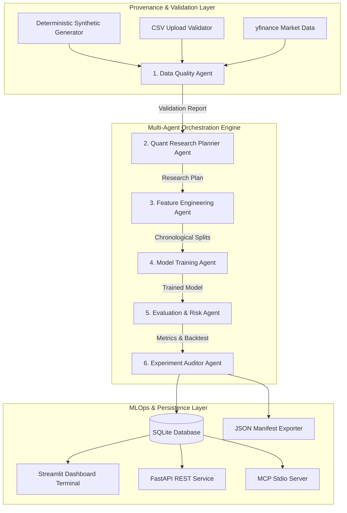

# ⚡ QuantLab Pro: Multi-Agent Quantitative ML Research Platform

[](https://quantlab-pro-2dbdnpq8kgkvndauqsicc9.streamlit.app/)
[](https://github.com/Dhanya562004/quantlab-pro)
[](https://www.python.org/)
[](https://pytorch.org/)
[](https://modelcontextprotocol.io/)
[](LICENSE)

> [!IMPORTANT]
> **Live Application URL**: 🚀 [https://quantlab-pro-2dbdnpq8kgkvndauqsicc9.streamlit.app/](https://quantlab-pro-2dbdnpq8kgkvndauqsicc9.streamlit.app/)
> 
> **QuantLab Pro** is an institutional-grade quantitative machine learning research platform designed around multi-agent orchestration, leakage-resistant feature engineering, reproducible experiment tracking, and Model Context Protocol (MCP) tool integration.
> 
> Aligned with **Tower Research Capital's Intern - AI/ML** core competencies, QuantLab Pro provides a complete test-driven Python research framework for market time-series analysis, baseline & neural network model evaluation, backtest simulation, and MLOps inference.

---

## 🏛️ System Architecture Topology

QuantLab Pro coordinates a deterministic multi-agent pipeline passing typed Pydantic state across 6 specialized research agents:



---

## 🔑 Core Competencies & Feature Matrix

| Competency | Implementation Details | Module Location |
| :--- | :--- | :--- |
| **Multi-Agent Orchestration** | 6 specialized typed agents (`DataQuality`, `Planner`, `Feature`, `Training`, `Evaluation`, `Auditor`) with sequential state transitions and step tracing. | [`quantlab/agents/`](file:///quantlab/agents/) & [`quantlab/orchestration/`](file:///quantlab/orchestration/) |
| **Leakage-Resistant ML** | Target shifted by $-h$, lagged technical indicators (RSI, MACD, Volatility ratios), chronological train/val/test splits, and scaler fit strictly on training data. | [`quantlab/features/builder.py`](file:///quantlab/features/builder.py) |
| **Statistical & Neural ML** | Majority Class baseline, scikit-learn Logistic Regression, and PyTorch MLP classifier with fixed random seed reproducibility. | [`quantlab/models/`](file:///quantlab/models/) |
| **Research Backtester** | Long/cash strategy simulation with transaction cost penalties (bps), Sharpe ratio, Sortino ratio, max drawdown, and equity curves. | [`quantlab/evaluation/backtest.py`](file:///quantlab/evaluation/backtest.py) |
| **Official MCP Integration** | Native MCP server exposing allowlisted tools over stdio transport using official Python `mcp` SDK. | [`mcp_server/server.py`](file:///mcp_server/server.py) |
| **MLOps & REST API** | SQLite experiment database, SHA-256 dataset fingerprinting, JSON reproducibility manifests, and FastAPI endpoints. | [`quantlab/storage/db.py`](file:///quantlab/storage/db.py) & [`api/main.py`](file:///api/main.py) |
| **Agentic Coding Workflows** | Complete developer guide detailing Claude Code, Cursor, and Codex refactoring and debugging prompt workflows. | [`AGENTIC_WORKFLOW_GUIDE.md`](file:///AGENTIC_WORKFLOW_GUIDE.md) |

---

## 🛡️ Data Provenance & Quantitative Validation Audit

QuantLab Pro enforces strict data quality and mathematical integrity before any model training:

- **Data Provenance Modes**:
  1. `Synthetic`: Deterministic random-walk OHLCV generator with seed control.
  2. `CSV Upload`: File parser with column standardization.
  3. `yfinance`: Optional live historical market data downloader.
- **Cryptographic Fingerprinting**: Calculates a SHA-256 checksum over raw dataset records.
- **Quantitative Audit Checks (`validate_ohlcv_data`)**:
  - Schema & Column Completeness (`Date`, `Open`, `High`, `Low`, `Close`, `Volume`).
  - Strict Ascending Date Monotonicity & Duplicate Timestamp Detection.
  - Price Validity ($Open, High, Low, Close > 0$) & Boundary Integrity ($High \ge \max(Open, Close)$ and $Low \le \min(Open, Close)$).
  - Single-period return jump outlier detection ($> 5 \sigma$).
  - Minimum sample size adequacy ($N \ge 100$).

---

## 🤖 The 6 Specialized Quantitative Research Agents

```
 ┌───────────────────────────┐      ┌───────────────────────────┐      ┌───────────────────────────┐
 │ 1. Data Quality Agent     │ ───► │ 2. Research Planner Agent │ ───► │ 3. Feature Agent          │
 │ Schema & Price Auditing   │      │ Model & Horizon Selection │      │ Features & Scaled Splits  │
 └───────────────────────────┘      └───────────────────────────┘      └───────────────────────────┘
               │                                                                     │
               ▼                                                                     ▼
 ┌───────────────────────────┐      ┌───────────────────────────┐      ┌───────────────────────────┐
 │ 6. Auditor Agent          │ ◄─── │ 5. Evaluation & Risk Agent│ ◄─── │ 4. Model Training Agent   │
 │ Manifest & SQLite Store   │      │ Held-Out Test & Backtest  │      │ PyTorch MLP & Baselines   │
 └───────────────────────────┘      └───────────────────────────┘      └───────────────────────────┘
```

1. **`DataQualityAgent`**: Validates raw dataset schema, pricing boundaries, and date monotonicity.
2. **`QuantResearchPlannerAgent`**: Selects model architecture from an allowlisted registry and formulates research plan.
3. **`FeatureEngineeringAgent`**: Computes leakage-safe technical indicators and chronological train/val/test splits.
4. **`ModelTrainingAgent`**: Fits baseline or PyTorch MLP model with fixed random seeds.
5. **`EvaluationRiskAgent`**: Evaluates held-out test split, runs research backtest with transaction costs, and audits leakage flags.
6. **`ExperimentAuditorAgent`**: Compiles JSON manifest and saves experiment run to SQLite database (`ExperimentStorage`).

---

## 🔌 Model Context Protocol (MCP) & Safe Tool Calling

QuantLab Pro implements an allowlisted tool registry (`ToolRegistry`) with Pydantic argument schemas:

- `dataset_summary`: Generates summary statistics and SHA-256 fingerprint.
- `validate_dataset`: Executes quantitative data quality audit.
- `run_experiment`: Runs end-to-end training and backtest pipeline.
- `get_experiment_metrics`: Fetches metrics from SQLite database.
- `get_experiment_manifest`: Retrieves JSON manifest from SQLite.

### Running MCP Tools & Local Client
```bash
# Run Local MCP Integration Client Verification
python -m mcp_server.client

# Launch MCP Stdio Server
python -m mcp_server.server
```

---

## 🌐 FastAPI REST Inference & Monitoring Service

Run local inference REST API:
```bash
uvicorn api.main:app --reload --port 8000
```

| Endpoint | Method | Description |
| :--- | :--- | :--- |
| `/health` | `GET` | Service status & database connectivity check |
| `/predict` | `POST` | Real-time feature vector inference -> prediction & confidence |
| `/metrics/{experiment_id}` | `GET` | Fetch recorded metrics by experiment ID |
| `/monitoring/distribution` | `GET` | Historical accuracy/Sharpe distribution & monitoring stats |

---

## ⚡ Quick Start & Setup Guide

### 1. Clone & Install Dependencies
```bash
git clone https://github.com/Dhanya562004/quantlab-pro.git
cd quantlab-pro
pip install -r requirements.txt
```

### 2. Launch Streamlit Dark Purple Dashboard Terminal
```bash
streamlit run app.py
```
> Access local dashboard in browser: `http://localhost:8501`

### 3. Run PyTest Test Suite (100% Passing)
```bash
pytest -v
```

### 4. Run Ruff Linter
```bash
ruff check .
```

---

## 🚀 Live Streamlit Deployment

- **Live URL**: [https://quantlab-pro-2dbdnpq8kgkvndauqsicc9.streamlit.app/](https://quantlab-pro-2dbdnpq8kgkvndauqsicc9.streamlit.app/)
- **Repository**: [https://github.com/Dhanya562004/quantlab-pro.git](https://github.com/Dhanya562004/quantlab-pro.git)
- **Main Entry Point**: `app.py`

---

## 🔒 Educational Research Disclaimer

**QuantLab Pro is designed exclusively for educational research, academic exploration, and technical demonstration.** 
It does NOT provide investment advice, financial recommendations, or automated live trading capability. Simulated backtests do not guarantee future live trading results.
